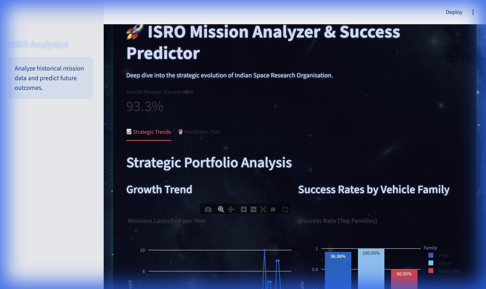

# 🚀 ISRO Mission Analyzer

[](https://www.python.org/)
[](https://streamlit.io/)
[](https://fastapi.tiangolo.com/)
[](https://opensource.org/licenses/MIT)

## 📖 Overview

**ISRO Mission Analyzer** is a comprehensive, data-driven web application designed to analyze the historical missions of the Indian Space Research Organisation (ISRO). It combines a robust backend for data processing with an interactive frontend dashboard to visualize mission trends, success rates, and strategic shifts over decades. Additionally, it features a Machine Learning model to predict the success probability of future missions based on vehicle and orbital parameters.



## ✨ Features

- **📊 Historical Data Analysis**: Explore trends in mission launches, analyzing success rates across different vehicle families (PSLV, GSLV, etc.) and decades.
- **🚀 Space-Themed UI**: An immersive, dark-mode design with a starry background and rocket visuals for a premium user experience.
- **📈 Enhanced Visualizations**: Includes a "Mission Capabilities" chart (Stacked Bar) to clearly show launch vehicle versatility across different orbits.
- **🤖 Predictive Modeling**: A trained Random Forest Classifier predicts the probability of mission success given specific launch parameters.
- **📈 Interactive Dashboard**: A user-friendly Streamlit interface offering dynamic charts, filters, and visualizations powered by Plotly.
- **🔌 RESTful API**: A high-performance FastAPI backend that serves analysis data and exposes the ML model for predictions.
- **📂 SQL Integration**: Seamlessly parses and loads mission data from SQL dumps for analysis.

## 🛠️ Tech Stack

### Frontend
- **Streamlit**: For building the interactive web dashboard.
- **Plotly**: For creating rich, interactive data visualizations.

### Backend
- **FastAPI**: For building high-performance APIs.
- **Pandas**: For data manipulation and analysis.
- **scikit-learn**: For training and serving the predictive machine learning model.
- **SQLite**: In-memory database for efficient data handling.

## 🚀 Getting Started

### Prerequisites
- Python 3.9 or higher
- Pip (Python Package Manager)

### Installation

1. **Clone the repository**
   ```bash
   git clone https://github.com/Prashantsng26/Data-Analyst-Project-ISRO-Mission-Analyzer-.git
   cd Data-Analyst-Project-ISRO-Mission-Analyzer-
   ```

2. **Set up a Virtual Environment**
   ```bash
   python -m venv venv
   source venv/bin/activate  # On Windows: venv\Scripts\activate
   ```

3. **Install Dependencies**
   ```bash
   pip install -r requirements.txt
   ```

## ⚙️ Configuration
The frontend connects to the backend via `API_URL`. By default, it points to `http://127.0.0.1:8000/api`. You can override this by setting the environment variable:
```bash
export API_URL="http://your-backend-url/api"
```

## 🏃‍♂️ How to Run

### Method 1: VS Code (Recommended)
1. Open the **Run and Debug** view in VS Code (Activity Bar on the left).
2. Select **"Run Full Stack App"** from the dropdown at the top.
3. Click the green Play button.
   - *This automatically handles the environment and runs both backend and frontend.*

### Method 2: One-Click Script
Open your terminal in the project directory and run:
```bash
./run_app.sh
```

### Method 3: Manual Terminal Commands
If you prefer identifying issues step-by-step, run the backend and frontend in separate terminals:

**Terminal 1 (Backend API):**
```bash
source venv/bin/activate
uvicorn backend.main:app --host 0.0.0.0 --port 8000 --reload
```

**Terminal 2 (Frontend Dashboard):**
```bash
source venv/bin/activate
streamlit run app.py
```

## 📂 Project Structure

```
├── backend/                # Backend logic
│   ├── main.py             # FastAPI entry point & endpoints
│   ├── model.py            # ML Model logic
│   └── database.py         # DB connection & queries
├── frontend/               # Frontend components (if separated)
├── data/                   # Data files (SQL dumps, etc.)
├── app.py                  # Streamlit Dashboard entry point
├── requirements.txt        # Project dependencies
├── run_app.sh              # Helper script to run the app
└── README.md               # Project documentation
```

## 🤝 Contributing

Contributions are welcome! Please feel free to submit a Pull Request.

1. Fork the project
2. Create your Feature Branch (`git checkout -b feature/AmazingFeature`)
3. Commit your Changes (`git commit -m 'Add some AmazingFeature'`)
4. Push to the Branch (`git push origin feature/AmazingFeature`)
5. Open a Pull Request

## 📄 License

This project is licensed under the MIT License - see the [LICENSE](LICENSE) file for details.

---
Made with ❤️ by [Prashant Singh](https://github.com/Prashantsng26)
